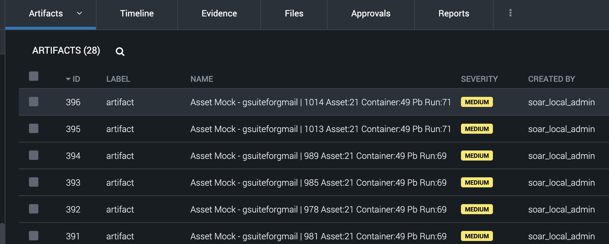

# SOAR Asset Mocker
SOAR Asset Mocker is an optional addon for SOAR connectors that allows for recording and replaying connectors transport. As a result, you may expect faster playbook development and lower resource usage.

# Table of Contents
1. [Quick start](#Quickstart)
2. [Connector Installation](#Installation)
3. [CLI](#CLI)
4. [Environmental Variables](#Environmental-Variables)
5. [Content redaction](#content-redaction)
6. [Limitations](#limitations)
7. [List of supported connectors](#list-of-supported-connectors)

# Installation

If you are developing SOAR connector, you can add Asset Mocker to it.
Start by installing Asset Mocker
> pip install soar-asset-mocker

Now you have access to `soar-asset-mocker cli`, more about it under [cli chapter](#CLI).
To automatically load Asset Mocker to connector just write the command below, with right access path for connector json file.
> soar-asset-mocker inject ./connector_directory/connector.json

After execution you can check what has been changed in your connector, you can expect a new import in main connector module and a new decorator:
```
from soar_asset_mocker import AssetMocker, MockType
...
class ExampleConnector(BaseConnector):
    ...
   @AssetMocker.use(MockType.HTTP)
   def handle_action(self, param):
    ...
```
You should also see `soar-asset-mocker` in `requirements.txt` file. Now you can commit your changes, recompile your app and load it into SOAR to enhance playbook development experience.

# Quickstart

Connector with Asset Mocker will not look and behave any different than any other connector by default. To enable Asset Mocker you have to add [envronmental variables](#environmental-variables) to your asset.


To start recording actions from playbook runs just set `SOAR_AM_MODE` to `RECORD` and run playbook using your modified asset. 

After execution, recordings will be visible under container artifacts or files.


Now we can use CLI to grab and merge all the recordings into one file, run the command presented below and follow the steps outputed by this command.

> soar-asset-mocker fetch <container_id> myrecordingname.mock

After preparing your mock file, you can upload it to any container in SOAR and point at it in asset configuration


Now, with recorded connector's transport, you can run playbooks with mocked external APIs!

# CLI

CLI can be utilised to automate some parts of Asset Mocker workflow.
For now it supports 2 commands:
* Inject Asset Mocker into SOAR Connector.
    > soar-asset-mocker inject ./connector_directory/connector.json
    
    It will inject Asset Mocker into connectors code, together with updating dependencies. User is still required to check applied changes and run pre-commit actions.

* Download and merge recording files.
    > soar-asset-mocker fetch <container_id> myrecordingname.mock

    This command gathers recordings from SOAR container. Then, user selects which of them should be merged together into one file. After that, user can load that file into SOAR and start mocking with it.


# Environmental Variables

* SOAR_AM_MODE - RECORD|MOCK|NONE (default: NONE)
    * RECORD - Asset Mocker will record all HTTP traffic comming through Python sockets of connector process. 
    * MOCK - Requires a file name or vault id. It will load recording and use it to mock all HTTP traffic. It will throw an error if there is any new unrecorded traffic.
    * NONE - Asset Mocker is deactivated
* SOAR_AM_SCOPE - Sets the scope of work for mocker:
    * ALL - All actions on SOAR will be recorded/mocked
    * VPE - Only actions executed through VPE will be recorded/mocked (default)
* SOAR_AM_CONTAINER_ID - It determines where recordings will be stored. By default (no value), recordings will be stored in the same container that the action was executed in.
* SOAR_AM_FILE_NAME - A name of recording to be used for mocking. Mocking will fail if file is not found.
* SOAR_AM_FILE_VAULT_ID - Alternatively to file name, vault id can be used to query for uploaded recording. When file name and vault id are both provided, Asset Mocker will try to find a recording that match both fields.
* SOAR_AM_FILE_CONTAINER_ID - If there might be two the same file names for recordings, container ID can be specified to make the query more specific.

# Content redaction

* By default content of recorded HTTP requests and responses contains redacted information such as tokens, emails, passwords and other secrets. Instead of actual value of that field you'll see `*ASSET_MOCKER_REDACTED*` string.

# Limitations

* Asset Mocker as of now does not make use of state. It means that looped action in which response changes each iteration might not get properly recorded.
* Asset Mocker cannot record any traffic that happens outside of Python runner. It means that any communication that is done via a subprocess spawned by connector can't be tracked.

# List of supported connectors

TBD
